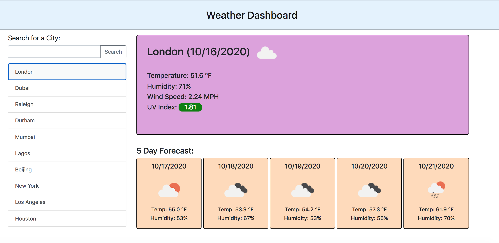

# WeatherApp

This Weather App allows the user to search for a city and upon submission, receive the current weather information for that city. That includes the temperature, the humidity, the wind speed and the UV Index. They are also presented with a 5 day forecast that informs of the temperature and humidity for the next 5 days.

Upon searching a city, that city is saved and added to the page. If the user presses that city name again, the weather dashboard will once again display the info for that city.

